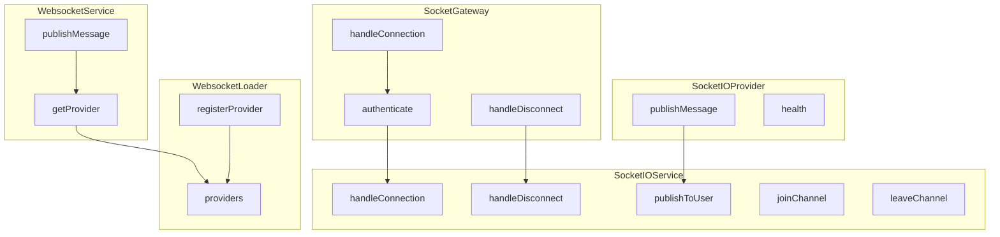

# Websocket

Real-time bidirectional communication between server and clients.

## Example usage

### Publishing messages
```typescript
import { Injectable } from '@nestjs/common';
import { WebsocketService } from '~common/websocket/websocket.service';
import { UserProfileUpdateSuccessEvent } from './events/user-profile-update.event';

@Injectable()
export class MyService {
  constructor(
    private readonly websocketService: WebsocketService,
  ) {}

  async updateProfile(userId: string, profileData: any): Promise<void> {
    // Do some work...

    // Notify clients about the update
    this.websocketService.publishMessage(new UserProfileUpdateSuccessEvent(userId, profileData));
  }
}
```

### Creating a WebSocket Gateway
```typescript
import { ConnectedSocket, SubscribeMessage, WebSocketGateway } from '@nestjs/websockets';
import { LoggerService } from '~common/logger';

@WebSocketGateway({
  cors: true,
})
export class ExampleWebsocketGateway {
  constructor(private readonly logger: LoggerService) {}

  @SubscribeMessage('do-something')
  async doSomething(@ConnectedSocket() client: any, payload: any): Promise<void> {
    const userId = client.data.auth.userId;
    if (!userId) {
      return;
    }
    this.logger.log('doSomething', payload);

    // Handle the websocket message
    // await this.exampleService.doSomething(userId);
  }
}
```

### Setup

```typescript
@Module({
  imports: [
    WebsocketModule.forRoot([
      // Add your provider: e.x.
      SocketIOWebsocketPlugin,
    ]),
  ],
})
export class AppModule {}
```

## Architecture

The websocket module provides real-time communication capabilities using Socket.IO under the hood. It consists of several key components:

1. **WebsocketService**: Main service for publishing messages to connected clients
2. **WebsocketLoader**: Manages websocket providers
3. **SocketIOProvider**: Default implementation using Socket.IO
4. **SocketIOService**: Handles Socket.IO specific functionality like connections and channels
5. **WebsocketGateway**: Base gateway for handling socket connections and messages



## Features

- Authentication support via Bearer token
- User-specific channels
- Multiple client connections per user
- Event-based communication
- Cross-Origin Resource Sharing (CORS) support
- Provider-based architecture for flexibility
